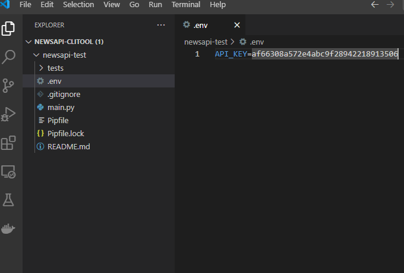

## Python need to be installed and pip is configured. 
### Please follow this guide for [linux](https://docs.python.org/3/using/unix.html#getting-and-installing-the-latest-version-of-python) or [windows](https://docs.python.org/3/using/windows.html) in case of any doubts.

## clone the repo
```
git clone https://github.com/
cd newsapi-test
```

## Install pipenv
```pip install pipenv```

## Activate environment
```pipenv shell```

## Install dependencies
```pipenv install```

## Generate an API key for [newsapi](https://newsapi.org/)

### Signup for a new account [here](https://newsapi.org/register)
Then you'll get an API-KEY. 

#### .env file
1. Create a .env file in `newsapi-test` folder.
2. Copy the API Key from https://newsapi.org/account page.
3. paste it in your .env file in the following format.

    `API_KEY=your-api-key`

    

## Run the script
```python main.py```

Run the above command and follow on-screen prompts.

## Run the unit tests
```python -m pytest```


## Notes:

1. The first run might take a bit longer because the `bert-extractive-summarizer` downloads it's data. 
2. It will happen for both english and german but only on the first run.
3. I assumed that the accuracy of the relevancy is not important for this task and relied on the third party news service provider. 
4. We can get at max 500 news items per topic. And our free key will get errors after that
